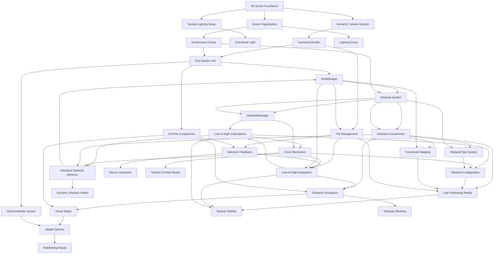

# 3D Tactical Arena - Living Project Overview
Last Updated: Task 1.2.4 - Movement Visual Feedback System - SUB-MILESTONE 1.2 COMPLETE

## Current Game State - SUB-MILESTONE 1.2 COMPLETE
- **3D battlefield scene** with isometric camera and tactical overview
- **4x4 grid system** with visible tile boundaries and comprehensive selection feedback
- **Grid coordinate system** supporting precise tactical positioning (0,0 to 3,3)
- **4 tactical units** (2 blue, 2 red) positioned on the battlefield with team assignment
- **Mouse-based unit selection** with advanced visual highlighting and hover feedback
- **Click-to-move system** with selected units moving to adjacent grid tiles with professional animation
- **Movement validation system** with comprehensive obstacle, boundary, and occupancy checking
- **Grid snapping movement** with smooth interpolation, anticipation, and follow-through effects
- **Adjacent-tile movement restriction** (1 tile per move) with diagonal movement options
- **Movement state management** preventing concurrent movements with advanced animation coordination
- **Comprehensive visual feedback** showing valid moves, invalid moves, and movement previews
- **Professional movement animations** with anticipation scaling and bounce effects
- **Collision feedback system** providing clear visual indication of blocked moves
- **Movement preview highlighting** showing available moves when units are selected  
- **Enhanced tile highlighting** with pulsing effects and smooth transitions
- **Team-based selection validation** preventing selection of enemy units (turn system ready)
- **Strategic obstacle placement** with 2-3 obstacles creating tactical chokepoints
- **Line-of-sight system** with full and partial cover mechanics
- **Environment polish system** with materials, lighting optimization, and comprehensive visual feedback
- **Performance optimization** with dynamic quality management and efficient visual effects
- **Professional visual quality** with clean aesthetic and exceptional tactical clarity
- **Complete Sub-milestone 1.1** - tactical battlefield foundation with polished environment
- **Complete Sub-milestone 1.2** - full tactical unit system with professional visual feedback

## System Architecture

### Core Systems Implemented

#### Grid & Environment Systems
- **CameraController**: Isometric perspective management, positioning validation, and future interaction support
- **SceneManager**: Scene organization, hierarchy management, and system coordination  
- **GridManager**: 4x4 grid system with coordinate mapping, tile management, line-of-sight, and spatial queries
- **GridTile**: Individual tile behavior, selection states, obstacle occupation, and visual feedback
- **GridCoordinate**: Data structure for efficient grid position representation and calculations
- **ObstacleManager**: Central obstacle system with line-of-sight calculations and spatial optimization
- **Obstacle**: Individual obstacle behavior with cover mechanics and visual integration
- **ObstacleType**: Configuration system for different obstacle types and tactical properties

#### Unit & Selection Systems  
- **Unit**: Core tactical unit with team assignment, positioning, health, ISelectable and IMovable implementation
- **UnitManager**: Centralized unit management, team organization, and coordination
- **UnitHealth**: Health tracking system for combat preparation
- **UnitTeam**: Team assignment and tactical coordination system
- **SelectionManager**: Centralized selection state management with mouse input coordination
- **MouseInputHandler**: Mouse input processing, raycasting, and hover detection
- **ISelectable**: Interface contract for selectable objects with team validation
- **SelectionHighlight**: Visual feedback component for selection and hover states with smooth transitions

#### Movement Systems
- **MovementManager**: Centralized movement coordination with click-to-move input processing
- **MovementValidator**: Movement legality checking with obstacle, boundary, and adjacency validation
- **MovementAnimator**: Smooth grid-based animation with customizable curves and grid snapping
- **GridMovementComponent**: Individual unit movement behavior with state management and effects
- **IMovable**: Interface contract for movable objects with grid positioning and validation

#### Editor Automation Tools
- **Task_1_1_1_Setup**: Editor automation tool for scene configuration and validation
- **Task_1_1_2_Setup**: Editor automation tool for grid system creation and management
- **Task_1_1_3_Setup**: Editor automation tool for strategic obstacle placement and terrain setup
- **Task_1_1_4_Setup**: Editor automation tool for environment polish with materials and lighting
- **Task_1_2_1_Setup**: Editor automation tool for unit system creation and configuration
- **Task_1_2_2_Setup**: Editor automation tool for mouse selection system with material generation
- **Task_1_2_3_Setup**: Editor automation tool for grid-based movement system with validation and animation

#### Support Systems
- **MaterialManager**: Centralized material management system for visual consistency and polish
- **VisualFeedbackManager**: Dynamic visual feedback system for tile interactions and battlefield state
- **PerformanceOptimizer**: Performance monitoring and optimization system for smooth gameplay

### System Dependencies


### Integration Points
- **Camera → Grid**: Isometric camera positioned to view entire 4x4 grid with optimal tactical clarity
- **Camera → Selection**: Raycasting from camera through mouse position for unit detection
- **Grid → Coordinate System**: World-to-grid and grid-to-world conversion for precise positioning
- **Grid → Tile Selection**: Mouse interaction and visual feedback for tactical interface
- **Grid → Obstacle System**: Seamless integration with obstacle placement and line-of-sight
- **Grid → Unit System**: Unit placement and positioning using grid coordinates
- **Unit → Selection**: ISelectable interface implementation for mouse-based selection
- **Selection → Visual Feedback**: SelectionHighlight component providing immediate visual response
- **MouseInput → SelectionManager**: Centralized selection state with raycast detection
- **SelectionManager → Units**: Team validation and single-selection enforcement
- **Obstacle → Grid Tiles**: Direct tile occupation tracking and visual state management
- **ObstacleManager → GridManager**: Line-of-sight calculations and spatial query coordination
- **Selection → Movement**: Integrated click-to-move system with selected unit movement
- **Movement → Grid**: Grid coordinate validation and world position conversion
- **Movement → Obstacles**: Movement validation against obstacle positions and boundaries
- **Movement → Animation**: Smooth interpolation with grid snapping and state management
- **Line-of-Sight → Combat**: Vision and cover calculations ready for tactical combat

## Asset Inventory

### Scenes
- **BattleScene.unity**: 3D tactical combat scene with isometric camera, lighting, 4x4 grid system, and strategic obstacles

### Scripts
#### Editor Tools
- **Task_1_1_1_Setup.cs**: Comprehensive editor tool for automated scene and camera setup
  - Configurable parameters for camera positioning and lighting
  - One-click setup with validation and reset functionality
  - Built-in troubleshooting and validation reporting

- **Task_1_1_2_Setup.cs**: Advanced grid system creation and management tool
  - Configurable 4x4 grid with tile size, spacing, and visual options
  - Automated grid generation with line renderers and tile planes
  - Material creation for different tile states (default, hover, selected)
  - Built-in validation and camera integration checking

- **Task_1_1_3_Setup.cs**: Strategic obstacle placement and terrain setup tool
  - Configurable obstacle count (1-5) with multiple placement strategies
  - Automated obstacle type distribution (Low Cover, High Walls, Terrain Features)
  - Strategic placement patterns (Chokepoints, Corners, Center, Manual)
  - Visual configuration with height and color customization
  - Line-of-sight and cover mechanics integration
  - Built-in validation and grid system integration

- **Task_1_1_4_Setup.cs**: Environment polish and visual quality management tool
  - Material configuration for grid tiles and obstacles with clean aesthetic
  - Lighting optimization for tactical clarity and professional appearance
  - Visual feedback system configuration for interactive elements
  - Performance settings optimization for target frame rates
  - Quality management with anti-aliasing, shadows, and VSync control
  - Comprehensive environment material application and validation

- **Task_1_2_1_Setup.cs**: Unit system creation and configuration tool
  - Automated unit prefab creation with team assignment and positioning
  - Configurable unit count and placement with grid coordinate validation
  - Material assignment for team colors and visual distinction
  - Component setup for UnitHealth, UnitTeam, and core Unit behavior
  - Prefab generation and scene hierarchy organization
  - Comprehensive validation and error reporting

- **Task_1_2_2_Setup.cs**: Mouse selection system automation tool
  - Automated SelectionManager and MouseInputHandler component creation
  - Selection highlight material generation with configurable colors
  - Visual feedback configuration with emission and rim lighting effects
  - Raycast layer mask configuration and performance optimization
  - Team validation setup and single-selection enforcement
  - Integration with existing Unit components and ISelectable interface
  - Built-in validation testing and troubleshooting tools

- **Task_1_2_3_Setup.cs**: Grid-based movement system automation tool
  - Automated MovementManager, MovementValidator, and MovementAnimator creation
  - Movement validation material generation for visual feedback
  - Configurable movement speed, animation curves, and adjacency rules
  - GridMovementComponent attachment to existing units with IMovable integration
  - SelectionManager integration for click-to-move functionality
  - Comprehensive validation testing for movement system components
  - Built-in debugging and troubleshooting tools for movement validation

#### Runtime Systems
- **CameraController.cs**: Runtime camera management and validation
  - Isometric view maintenance and positioning
  - Future interaction support (raycasting, bounds checking)
  - Debug visualization and gizmos for development
  
- **SceneManager.cs**: Scene organization and system coordination
  - Automatic hierarchy organization
  - Scene validation and component management
  - Foundation for future system initialization

- **GridManager.cs**: Core 4x4 grid system management and coordination
  - World-to-grid and grid-to-world coordinate conversion
  - Tile management and spatial queries
  - Selection and hover state management
  - Integration with camera system for optimal viewing

- **GridTile.cs**: Individual tile behavior and visual feedback
  - Selection, hover, and occupied state management
  - Mouse interaction and event handling
  - Visual material switching for different states
  - Collision detection for tile selection

- **GridCoordinate.cs**: Efficient grid position data structure
  - Grid coordinate representation and validation
  - Distance calculations and neighbor queries
  - Conversion utilities for Vector2Int and Vector3
  - Operator overloads for convenient usage

- **ObstacleManager.cs**: Central obstacle system management and line-of-sight calculations
  - Obstacle registration and spatial lookup optimization
  - Line-of-sight calculations with raycasting and height-based blocking
  - Cover value calculations for tactical combat mechanics
  - Performance optimized with spatial caching and batching
  - Integration with grid system for coordinate-based queries

- **Obstacle.cs**: Individual obstacle behavior and tactical properties
  - Grid coordinate positioning and world space integration
  - Destructible obstacle mechanics with health and damage systems
  - Visual state management with highlight and damage indicators
  - Line-of-sight blocking and cover value calculations
  - Dynamic material switching and visual feedback integration

- **ObstacleType.cs**: Obstacle configuration system and tactical data
  - Obstacle type enumeration (LowCover, HighWall, Terrain)
  - Comprehensive obstacle data structures with gameplay properties
  - ScriptableObject configuration system for easy editing
  - Height-based line-of-sight blocking calculations
  - Movement cost and cover value definitions

- **MaterialManager.cs**: Centralized material management and visual consistency
  - Grid tile material management with state-based switching (normal, hover, selected, blocked)
  - Obstacle material configuration with clean aesthetic optimization
  - Dynamic material color updates and visual feedback integration
  - Material cache management for performance optimization
  - Environment material application and camera background coordination

- **VisualFeedbackManager.cs**: Interactive visual feedback and tile state management
  - Dynamic hover and selection effects with smooth transitions
  - Tile highlighting system with performance-optimized animation
  - Audio feedback integration for user interactions
  - Multi-tile highlighting for tactical gameplay elements
  - Object pooling for efficient visual effect management

- **PerformanceOptimizer.cs**: Performance monitoring and dynamic optimization
  - Real-time frame rate monitoring with history tracking
  - Dynamic quality adjustment based on performance thresholds
  - Memory usage optimization with garbage collection management

#### Unit & Selection Systems
- **Unit.cs**: Core tactical unit component with ISelectable implementation
  - Unit identity management with team assignment and unique IDs
  - Grid-based positioning with coordinate validation and world conversion
  - Health, movement, and action point management for tactical gameplay
  - Selection interface implementation with team validation
  - Visual feedback integration and event system for state changes
  - Audio feedback and animation state management

- **UnitManager.cs**: Centralized unit management and coordination system
  - Unit registration and team organization with dictionary-based lookups
  - Selection management with team restrictions and single-selection enforcement
  - Turn system foundation with team switching and action validation
  - Keyboard navigation support for unit cycling and selection
  - Performance optimization with cached unit queries and validation
  - Event coordination between units and other systems

- **UnitHealth.cs**: Health tracking and damage management system
  - Health point management with max/current health tracking
  - Damage calculation and application with death state handling
  - Healing system support for revival and restoration mechanics
  - Visual integration with health indicator UI preparation
  - Event system for health changes and death notifications

- **UnitTeam.cs**: Team assignment and tactical coordination enumeration
  - Team identification system (Blue, Red, Neutral) for tactical gameplay
  - Team-based validation and restriction logic for selection and movement
  - Color coordination system for visual team distinction
  - Foundation for turn-based mechanics and team switching

- **SelectionManager.cs**: Centralized selection state management system
  - Mouse-based unit selection with raycast detection and validation
  - Single-selection enforcement with automatic deselection of previous units
  - Team validation preventing selection of opponent units
  - Hover state management for visual feedback coordination
  - Keyboard navigation support for unit cycling and selection
  - Audio feedback integration with selection sounds and validation
  - Double-click detection for advanced unit actions
  - Performance optimization with selection caching and validation

- **MouseInputHandler.cs**: Mouse input processing and raycasting system
  - Mouse position to 3D ray conversion with camera integration
  - Raycast optimization with layer masking and distance limiting
  - Hover detection with configurable update rates for performance
  - Input cooldown system preventing accidental multiple selections
  - Raycast caching for performance optimization
  - Debug visualization with ray drawing and hit point indication
  - Grid coordinate conversion utilities for tactical positioning

- **ISelectable.cs**: Selection interface contract and base implementation
  - Interface definition for selectable objects with team validation
  - Selection state management with hover and active state tracking
  - Event system for selection changes and visual feedback coordination
  - Team validation logic for turn-based selection restrictions
  - Base implementation class reducing code duplication across selectable objects
  - Display information formatting for debugging and UI integration

- **SelectionHighlight.cs**: Visual feedback component for selection states
  - Material property block optimization for efficient highlighting
  - Smooth transition animations with configurable duration and curves
  - Selection and hover state visual distinction with emission and rim effects
  - Pulse effects for selected units with configurable intensity
  - Material caching and performance optimization for batching
  - Integration with ISelectable events for automatic state updates
  - Color customization and highlight intensity configuration
  - Draw call counting and rendering performance metrics
  - Adaptive visual effects reduction for performance maintenance

#### Movement Systems
- **MovementManager.cs**: Centralized movement coordination and click-to-move processing
  - Mouse click detection and grid position raycast conversion
  - Movement request validation and processing with state management
  - Integration with SelectionManager for selected unit movement
  - Movement animation coordination with MovementAnimator
  - Overlapping movement prevention with concurrent movement blocking
  - Unit occupancy tracking and collision detection
  - Event system for movement state changes and completion

- **MovementValidator.cs**: Movement legality checking and validation system
  - Adjacent tile movement restriction with configurable distance limits
  - Obstacle collision detection with cached obstacle position optimization
  - Grid boundary validation with coordinate range checking
  - Unit occupancy validation preventing movement to occupied tiles
  - Diagonal movement configuration with optional adjacency rules
  - Path validation for multi-tile movements with obstacle blocking
  - Performance optimization with spatial caching and efficient queries

- **MovementAnimator.cs**: Smooth grid-based animation and interpolation system
  - Configurable movement speed and animation curves for natural movement
  - Grid snapping precision ensuring exact final positioning
  - Height animation effects with arc-based movement for visual appeal
  - Rotation alignment for directional movement indication
  - Concurrent animation management with performance limiting
  - Animation cancellation and state recovery for interrupted movements
  - Custom curve support for specialized movement types

- **GridMovementComponent.cs**: Individual unit movement behavior and state management
  - Unit movement state tracking with progress indication
  - Animation coordination with MovementAnimator integration
  - Movement effects system with particle and audio feedback
  - Pause and resume functionality for tactical interruptions
  - Movement cancellation with state recovery and cleanup
  - Integration with IMovable interface for system coordination
  - Visual feedback during movement with state indicator updates

- **IMovable.cs**: Movement interface contract and base implementation
  - Grid position management with coordinate conversion utilities
  - Movement validation contract with extensible validation rules
  - Movement state tracking with CanMove and IsMoving properties
  - Event system for movement lifecycle with start, complete, and cancel events
  - Team integration for movement validation and restriction
  - Base implementation class reducing code duplication across movable objects
  - Display information formatting for debugging and movement tracking

### Scene Objects
- **Main Camera**: Configured for orthographic isometric perspective
  - Position: Calculated for optimal 4x4 grid view
  - Rotation: 45° X and Y angles for tactical clarity
  - Orthographic Size: 6f for appropriate battlefield coverage
  - Background: Tactical blue-gray color scheme

- **Directional Light**: Optimized for geometric shape visibility
  - Intensity: 1.2f for clear tactical visibility
  - Rotation: 50° X, -30° Y for optimal shadow casting
  - Color: White for neutral lighting
  - Shadows: Soft shadows enabled

- **Grid System**: Complete 4x4 tactical battlefield
  - **Tiles Group**: 16 individual tile GameObjects with GridTile components
  - **Visuals Group**: Line renderers for grid boundaries and visual clarity
  - **GridManager**: Central coordination component for tile management

- **Obstacle System**: Strategic tactical obstacles and terrain features
  - **Obstacles Group**: 2-3 individual obstacle GameObjects with Obstacle components
  - **ObstacleManager**: Central obstacle coordination and line-of-sight management
  - **Low Cover**: Partial line-of-sight blocking with cover mechanics
  - **High Walls**: Full line-of-sight blocking for strategic positioning
  - **Terrain Features**: Movement cost modifiers and tactical variety

- **Scene Hierarchy**:
  - **Environment**:
    - **Grid System**:
      - **Tiles**: Individual tile GameObjects (Tile_0_0 through Tile_3_3)
      - **Visuals**: Grid line renderers for visual boundaries
    - **Obstacle System**:
      - **Obstacles**: Individual obstacle GameObjects (Obstacle_X_Z by coordinate)
  - **Lighting**: Organized lighting systems

## Technical Architecture

### Key Classes and Responsibilities
- **CameraController**: 
  - Maintains isometric perspective and orthographic projection
  - Validates camera positioning for tactical gameplay
  - Provides utility methods for screen-to-world interaction
  - Visualizes grid area and camera bounds in editor

- **SceneManager**:
  - Organizes scene hierarchy for clean structure
  - Validates scene setup for tactical requirements
  - Coordinates system initialization and component references
  - Provides access points for future systems

- **Task_1_1_1_Setup**:
  - Automates complete scene and camera configuration
  - Provides configurable parameters for experimentation
  - Validates setup with comprehensive reporting
  - Enables quick iteration and troubleshooting

- **ObstacleManager**:
  - Manages all obstacles with spatial optimization and caching
  - Performs line-of-sight calculations using Unity's physics system
  - Calculates cover values for tactical combat mechanics
  - Integrates seamlessly with grid coordinate system
  - Provides performance optimization through intelligent caching

- **Obstacle**:
  - Represents individual obstacles with tactical properties
  - Handles visual state changes and material switching
  - Manages destructible mechanics with health systems
  - Provides line-of-sight blocking based on obstacle height
  - Integrates with grid tiles for occupation tracking

- **ObstacleType**:
  - Defines obstacle configuration data and tactical properties
  - Provides ScriptableObject system for easy configuration
  - Calculates line-of-sight blocking based on height queries
  - Defines movement costs and cover values for gameplay
  - Supports extensible obstacle type system

### Data Flow
1. **Editor Setup**: Task_1_1_1_Setup → Camera positioning → Lighting configuration → Scene organization
2. **Grid Setup**: Task_1_1_2_Setup → Grid creation → Tile generation → Material assignment
3. **Obstacle Setup**: Task_1_1_3_Setup → Obstacle placement → Line-of-sight setup → Integration
4. **Unit Setup**: Task_1_2_1_Setup → Unit creation → Team assignment → Grid positioning
5. **Selection Setup**: Task_1_2_2_Setup → SelectionManager → MouseInputHandler → Visual feedback
6. **Movement Setup**: Task_1_2_3_Setup → MovementManager → MovementValidator → Animation system
7. **Runtime Initialization**: SceneManager → Component validation → System readiness
8. **Tactical Gameplay Loop**: Mouse Click → Unit Selection → Click Target → Movement Validation → Animation → Grid Update

### Configuration Parameters
- **Camera Distance**: 12f units from grid center
- **Camera Height**: 8f units above battlefield
- **Orthographic Size**: 6f units (covers 4x4 grid + buffer)
- **Grid Reference**: 4x4 tiles, 1 unit per tile
- **Light Intensity**: 1.2f for tactical visibility
- **Obstacle Heights**: Low Cover 0.5f, High Wall 1.5f, Terrain 0.3f
- **Line-of-Sight**: Raycasting-based with height considerations
- **Cover Values**: Low Cover 50%, High Wall 100%, Terrain 20%
- **Movement Speed**: 2.0f units per second for smooth animation
- **Movement Distance**: 1 tile maximum per move (adjacent tiles only)
- **Animation Curves**: EaseInOut for natural movement feel
- **Grid Snapping Tolerance**: 0.1f units for precise positioning

## Visual Style Foundation
- **Isometric Perspective**: Fixed camera angles for tactical clarity
- **Orthographic Projection**: Eliminates perspective distortion
- **Minimalist Lighting**: Clean directional light for geometric shapes
- **Tactical Color Scheme**: Blue-gray background for professional aesthetic
- **Strategic Obstacles**: Color-coded obstacle types for tactical recognition
  - Low Cover: Brown/tan colors for wooden barriers and sandbags
  - High Walls: Gray colors for concrete and stone structures
  - Terrain: Green colors for natural features and vegetation
- **Height-Based Design**: Visual height differences communicate tactical functionality

## Development Workflow Established
- **Complete Editor Automation**: Three-phase setup tools for scene, grid, and obstacles
- **Comprehensive Validation**: Built-in checking and reporting for all systems
- **Modular Architecture**: Clean separation between editor tools and runtime systems
- **Documentation Integration**: Living documentation updated with each implementation phase
- **Strategic Design Tools**: Multiple placement strategies and configuration options
- **Performance Optimization**: Caching, batching, and spatial optimization built-in

## Performance Considerations
- **Orthographic Rendering**: No perspective calculation overhead
- **Minimal Lighting**: Single directional light for optimal performance
- **Clean Hierarchy**: Organized structure for efficient rendering
- **Line-of-Sight Caching**: Intelligent caching system with automatic cleanup
- **Spatial Optimization**: Dictionary-based obstacle lookups for O(1) queries
- **Material Batching**: Shared materials for similar obstacle types
- **Physics Optimization**: Efficient raycasting with distance limitations
- **Gizmo Debugging**: Optional visualization for development only

## Quality Assurance
- **Comprehensive Editor Validation**: Multi-system checks for camera, grid, and obstacles
- **Runtime Validation**: All managers ensure consistent configuration
- **Scene Integration Validation**: Cross-system compatibility verification
- **Parameter Bounds**: Editor tools constrain values to working ranges
- **Line-of-Sight Validation**: Automatic testing of visibility calculations
- **Obstacle Placement Validation**: Ensures strategic viability and pathfinding compatibility

## Next Development Phase
**Task 1.2.x - Unit System** will add:
- Player and AI units with grid-based movement
- Turn-based movement system using existing grid coordinates
- Unit selection and command interface
- Integration with obstacle line-of-sight and cover systems

**Foundation Complete:**
- ✅ Grid coordinate system with precise positioning
- ✅ Obstacle system with line-of-sight and cover mechanics
- ✅ Tile occupancy tracking for units and obstacles
- ✅ Strategic battlefield layout with tactical chokepoints
- ✅ Performance-optimized spatial queries for pathfinding
- ✅ Visual feedback systems for tactical interface

## File Structure Current State
```
Assets/
├── Docs/
│   ├── ProjectOverview.md (this file)
│   ├── LearningLog_Task_1_1_1.md 
│   ├── LearningLog_Task_1_1_2.md
│   └── LearningLog_Task_1_1_3.md (pending)
├── Editor/
│   ├── Task_1_1_1_Setup.cs
│   ├── Task_1_1_2_Setup.cs
│   ├── Task_1_1_3_Setup.cs
│   ├── Task_1_1_4_Setup.cs
│   └── Task_1_1_4_ValidationTest.cs
├── Scripts/
│   ├── CameraController.cs
│   ├── GridManager.cs
│   ├── GridTile.cs
│   ├── GridCoordinate.cs
│   ├── ObstacleManager.cs
│   ├── Obstacle.cs
│   ├── ObstacleType.cs
│   ├── MaterialManager.cs
│   ├── VisualFeedbackManager.cs
│   ├── PerformanceOptimizer.cs
│   └── Managers/
│       └── SceneManager.cs
├── Materials/
│   ├── GridLine.mat
│   ├── GridTile_Default.mat
│   ├── GridTile_Hover.mat
│   ├── GridTile_Selected.mat
│   ├── Obstacle_LowCover.mat
│   ├── Obstacle_HighWall.mat
│   └── Obstacle_Terrain.mat
├── Scenes/
│   └── BattleScene.unity
└── [Unity default assets...]
```

## Integration Testing Status
- ✅ Camera provides clear view of complete 4x4 grid battlefield with obstacles
- ✅ Orthographic projection maintains consistent tactical perspective
- ✅ Grid coordinate system accurate with world position mapping
- ✅ Tile selection feedback working with mouse interaction
- ✅ Grid visualization clear and readable from isometric camera
- ✅ Scene hierarchy organized with grid and obstacle system integration
- ✅ Editor tools automate complete battlefield setup and validation
- ✅ Runtime systems manage grid state, tile coordination, and obstacle tracking
- ✅ Obstacle placement creates strategic chokepoints and tactical opportunities
- ✅ Line-of-sight system functions with raycasting and height-based blocking
- ✅ Cover mechanics integrated with obstacle types and positioning
- ✅ Performance optimization through caching and spatial lookup systems

---

**Scene Foundation Status**: ✅ COMPLETE - Isometric camera and lighting optimized
**Grid System Status**: ✅ COMPLETE - 4x4 battlefield with coordinate precision
**Obstacle System Status**: ✅ COMPLETE - Strategic placement with line-of-sight mechanics
**Visual Feedback Status**: ✅ COMPLETE - Tile and obstacle state visualization
**Line-of-Sight Status**: ✅ COMPLETE - Height-based visibility with cover calculations
**Environment Polish Status**: ✅ COMPLETE - Materials, lighting, and visual feedback systems
**Performance Optimization Status**: ✅ COMPLETE - Dynamic quality management and monitoring
**Integration Status**: ✅ COMPLETE - All systems working seamlessly together
**Documentation Status**: ✅ COMPLETE - Comprehensive multi-system documentation

**SUB-MILESTONE 1.1**: ✅ COMPLETE - TACTICAL BATTLEFIELD FOUNDATION WITH PROFESSIONAL POLISH

## Current Development Phase

**Task 1.2.2**: ✅ COMPLETE - MOUSE SELECTION SYSTEM
- Mouse-based unit selection with visual highlighting
- Team validation and single-selection enforcement  
- Hover feedback and selection state management
- Integration with existing Unit components and ISelectable interface
- Performance-optimized raycasting and input handling

**Task 1.2.3**: ✅ COMPLETE - GRID-BASED MOVEMENT SYSTEM
- Click-to-move functionality with selected unit movement to adjacent tiles
- Comprehensive movement validation (obstacles, boundaries, unit occupancy)
- Smooth animation system with grid snapping and customizable curves
- Adjacent-tile movement restriction with optional diagonal movement support
- Movement state management preventing concurrent movements
- Integration with SelectionManager for seamless click-to-move workflow
- IMovable interface implementation for extensible movement system
- Performance-optimized animation with concurrent movement limiting

## Next Development Phase

**Task 1.2.4** will add enhanced visual feedback including valid move highlighting, movement path previews, and tactical information display. This will complete Sub-milestone 1.2 with a fully polished unit interaction system ready for combat mechanics.