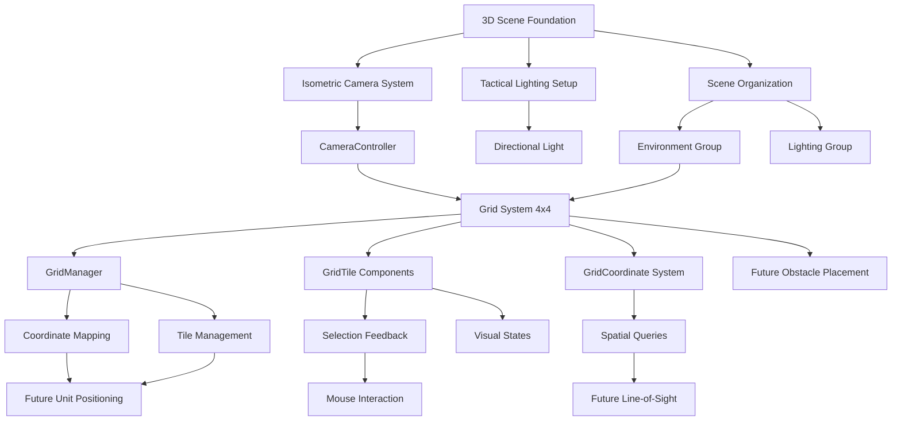

# 3D Tactical Arena - Living Project Overview
Last Updated: Task 1.1.2 - Create Grid System

## Current Game State
- **3D battlefield scene** with isometric camera and tactical overview
- **4x4 grid system** with visible tile boundaries and selection feedback
- **Grid coordinate system** supporting precise tactical positioning (0,0 to 3,3)
- **Tile selection feedback** with visual highlighting and mouse interaction
- **Spatial foundation** ready for unit placement and obstacle positioning
- **No interactive gameplay elements** yet - battlefield foundation established

## System Architecture

### Core Systems Implemented
- **CameraController**: Isometric perspective management, positioning validation, and future interaction support
- **SceneManager**: Scene organization, hierarchy management, and system coordination  
- **GridManager**: 4x4 grid system with coordinate mapping, tile management, and spatial queries
- **GridTile**: Individual tile behavior, selection states, and visual feedback
- **GridCoordinate**: Data structure for efficient grid position representation and calculations
- **Task_1_1_1_Setup**: Editor automation tool for scene configuration and validation
- **Task_1_1_2_Setup**: Editor automation tool for grid system creation and management

### System Dependencies


### Integration Points
- **Camera → Grid**: Isometric camera positioned to view entire 4x4 grid with optimal tactical clarity
- **Grid → Coordinate System**: World-to-grid and grid-to-world conversion for precise positioning
- **Grid → Tile Selection**: Mouse interaction and visual feedback for tactical interface
- **Grid → Future Units**: Coordinate system ready for unit placement and movement validation
- **Grid → Future Obstacles**: Tile-based obstacle placement and pathfinding integration
- **Grid → Future Line-of-Sight**: Coordinate-based visibility calculations between tiles

## Asset Inventory

### Scenes
- **BattleScene.unity**: 3D tactical combat scene with isometric camera, lighting, and 4x4 grid system

### Scripts
#### Editor Tools
- **Task_1_1_1_Setup.cs**: Comprehensive editor tool for automated scene and camera setup
  - Configurable parameters for camera positioning and lighting
  - One-click setup with validation and reset functionality
  - Built-in troubleshooting and validation reporting

- **Task_1_1_2_Setup.cs**: Advanced grid system creation and management tool
  - Configurable 4x4 grid with tile size, spacing, and visual options
  - Automated grid generation with line renderers and tile planes
  - Material creation for different tile states (default, hover, selected)
  - Built-in validation and camera integration checking

#### Runtime Systems
- **CameraController.cs**: Runtime camera management and validation
  - Isometric view maintenance and positioning
  - Future interaction support (raycasting, bounds checking)
  - Debug visualization and gizmos for development
  
- **SceneManager.cs**: Scene organization and system coordination
  - Automatic hierarchy organization
  - Scene validation and component management
  - Foundation for future system initialization

- **GridManager.cs**: Core 4x4 grid system management and coordination
  - World-to-grid and grid-to-world coordinate conversion
  - Tile management and spatial queries
  - Selection and hover state management
  - Integration with camera system for optimal viewing

- **GridTile.cs**: Individual tile behavior and visual feedback
  - Selection, hover, and occupied state management
  - Mouse interaction and event handling
  - Visual material switching for different states
  - Collision detection for tile selection

- **GridCoordinate.cs**: Efficient grid position data structure
  - Grid coordinate representation and validation
  - Distance calculations and neighbor queries
  - Conversion utilities for Vector2Int and Vector3
  - Operator overloads for convenient usage

### Scene Objects
- **Main Camera**: Configured for orthographic isometric perspective
  - Position: Calculated for optimal 4x4 grid view
  - Rotation: 45° X and Y angles for tactical clarity
  - Orthographic Size: 6f for appropriate battlefield coverage
  - Background: Tactical blue-gray color scheme

- **Directional Light**: Optimized for geometric shape visibility
  - Intensity: 1.2f for clear tactical visibility
  - Rotation: 50° X, -30° Y for optimal shadow casting
  - Color: White for neutral lighting
  - Shadows: Soft shadows enabled

- **Grid System**: Complete 4x4 tactical battlefield
  - **Tiles Group**: 16 individual tile GameObjects with GridTile components
  - **Visuals Group**: Line renderers for grid boundaries and visual clarity
  - **GridManager**: Central coordination component for tile management

- **Scene Hierarchy**:
  - **Environment**:
    - **Grid System**:
      - **Tiles**: Individual tile GameObjects (Tile_0_0 through Tile_3_3)
      - **Visuals**: Grid line renderers for visual boundaries
  - **Lighting**: Organized lighting systems

## Technical Architecture

### Key Classes and Responsibilities
- **CameraController**: 
  - Maintains isometric perspective and orthographic projection
  - Validates camera positioning for tactical gameplay
  - Provides utility methods for screen-to-world interaction
  - Visualizes grid area and camera bounds in editor

- **SceneManager**:
  - Organizes scene hierarchy for clean structure
  - Validates scene setup for tactical requirements
  - Coordinates system initialization and component references
  - Provides access points for future systems

- **Task_1_1_1_Setup**:
  - Automates complete scene and camera configuration
  - Provides configurable parameters for experimentation
  - Validates setup with comprehensive reporting
  - Enables quick iteration and troubleshooting

### Data Flow
1. **Editor Setup**: Task_1_1_1_Setup → Camera positioning → Lighting configuration → Scene organization
2. **Runtime Initialization**: SceneManager → Component validation → CameraController → System readiness
3. **Future Integration**: Camera → Grid system → Unit interaction → UI feedback

### Configuration Parameters
- **Camera Distance**: 12f units from grid center
- **Camera Height**: 8f units above battlefield
- **Orthographic Size**: 6f units (covers 4x4 grid + buffer)
- **Grid Reference**: 4x4 tiles, 1 unit per tile
- **Light Intensity**: 1.2f for tactical visibility

## Visual Style Foundation
- **Isometric Perspective**: Fixed camera angles for tactical clarity
- **Orthographic Projection**: Eliminates perspective distortion
- **Minimalist Lighting**: Clean directional light for geometric shapes
- **Tactical Color Scheme**: Blue-gray background for professional aesthetic
- **Grid-Ready Layout**: Scene positioned for future 4x4 battlefield

## Development Workflow Established
- **Editor Automation**: One-click scene setup with parameter configuration
- **Built-in Validation**: Comprehensive checking and reporting systems
- **Modular Architecture**: Clean separation between editor tools and runtime systems
- **Documentation Integration**: Living documentation updated with each task
- **Future-Ready Structure**: Scene and code organization prepared for grid system

## Performance Considerations
- **Orthographic Rendering**: No perspective calculation overhead
- **Minimal Lighting**: Single directional light for optimal performance
- **Clean Hierarchy**: Organized structure for efficient rendering
- **Gizmo Debugging**: Optional visualization for development only

## Quality Assurance
- **Editor Validation**: Built-in checks for camera positioning and lighting
- **Runtime Validation**: CameraController ensures consistent configuration
- **Scene Validation**: SceneManager verifies proper setup
- **Parameter Bounds**: Editor tool constrains values to working ranges

## Next Development Phase
**Task 1.1.3 - Obstacle Placement** will add:
- 2-3 strategic obstacles positioned on specific grid tiles
- Obstacle collision and pathfinding integration
- Tactical chokepoints and cover mechanics
- Visual obstacle representation matching grid aesthetic

**Preparation Complete:**
- Grid coordinate system ready for precise obstacle placement
- Tile occupancy states prepared for obstacle blocking
- Grid manager ready for pathfinding and line-of-sight calculations
- Visual foundation established for obstacle integration

## File Structure Current State
```
Assets/
├── Docs/
│   ├── ProjectOverview.md (this file)
│   ├── LearningLog_Task_1_1_1.md 
│   └── LearningLog_Task_1_1_2.md (pending)
├── Editor/
│   ├── Task_1_1_1_Setup.cs
│   └── Task_1_1_2_Setup.cs
├── Scripts/
│   ├── CameraController.cs
│   ├── GridManager.cs
│   ├── GridTile.cs
│   ├── GridCoordinate.cs
│   └── Managers/
│       └── SceneManager.cs
├── Materials/
│   ├── GridLine.mat
│   ├── GridTile_Default.mat
│   ├── GridTile_Hover.mat
│   └── GridTile_Selected.mat
├── Scenes/
│   └── BattleScene.unity
└── [Unity default assets...]
```

## Integration Testing Status
- ✅ Camera provides clear view of complete 4x4 grid battlefield
- ✅ Orthographic projection maintains consistent tactical perspective
- ✅ Grid coordinate system accurate with world position mapping
- ✅ Tile selection feedback working with mouse interaction
- ✅ Grid visualization clear and readable from isometric camera
- ✅ Scene hierarchy organized with grid system integration
- ✅ Editor tools automate grid setup and validation
- ✅ Runtime systems manage grid state and tile coordination

---

**Grid System Status**: ✅ COMPLETE - 4x4 battlefield ready for tactical gameplay
**Coordinate System Status**: ✅ COMPLETE - Precise positioning and conversion ready
**Visual Feedback Status**: ✅ COMPLETE - Tile selection and hover states functional
**Integration Status**: ✅ COMPLETE - Camera and grid systems working seamlessly
**Documentation Status**: ✅ COMPLETE - Comprehensive grid system documentation