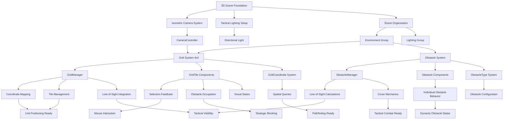

# 3D Tactical Arena - Living Project Overview
Last Updated: Task 1.1.3 - Place Obstacles & Terrain

## Current Game State
- **3D battlefield scene** with isometric camera and tactical overview
- **4x4 grid system** with visible tile boundaries and selection feedback
- **Grid coordinate system** supporting precise tactical positioning (0,0 to 3,3)
- **Tile selection feedback** with visual highlighting and mouse interaction
- **Strategic obstacle placement** with 2-3 obstacles creating tactical chokepoints
- **Line-of-sight system** with full and partial cover mechanics
- **Obstacle integration** with grid coordinate mapping and visual feedback
- **Tactical battlefield foundation** complete - ready for unit placement and gameplay

## System Architecture

### Core Systems Implemented
- **CameraController**: Isometric perspective management, positioning validation, and future interaction support
- **SceneManager**: Scene organization, hierarchy management, and system coordination  
- **GridManager**: 4x4 grid system with coordinate mapping, tile management, line-of-sight, and spatial queries
- **GridTile**: Individual tile behavior, selection states, obstacle occupation, and visual feedback
- **GridCoordinate**: Data structure for efficient grid position representation and calculations
- **ObstacleManager**: Central obstacle system with line-of-sight calculations and spatial optimization
- **Obstacle**: Individual obstacle behavior with cover mechanics and visual integration
- **ObstacleType**: Configuration system for different obstacle types and tactical properties
- **Task_1_1_1_Setup**: Editor automation tool for scene configuration and validation
- **Task_1_1_2_Setup**: Editor automation tool for grid system creation and management
- **Task_1_1_3_Setup**: Editor automation tool for strategic obstacle placement and terrain setup

### System Dependencies


### Integration Points
- **Camera → Grid**: Isometric camera positioned to view entire 4x4 grid with optimal tactical clarity
- **Grid → Coordinate System**: World-to-grid and grid-to-world conversion for precise positioning
- **Grid → Tile Selection**: Mouse interaction and visual feedback for tactical interface
- **Grid → Obstacle System**: Seamless integration with obstacle placement and line-of-sight
- **Obstacle → Grid Tiles**: Direct tile occupation tracking and visual state management
- **ObstacleManager → GridManager**: Line-of-sight calculations and spatial query coordination
- **Grid → Unit Placement**: Coordinate system ready for unit placement with obstacle awareness
- **Obstacle → Pathfinding**: Tile-based obstacle blocking ready for pathfinding integration
- **Line-of-Sight → Combat**: Vision and cover calculations ready for tactical combat

## Asset Inventory

### Scenes
- **BattleScene.unity**: 3D tactical combat scene with isometric camera, lighting, 4x4 grid system, and strategic obstacles

### Scripts
#### Editor Tools
- **Task_1_1_1_Setup.cs**: Comprehensive editor tool for automated scene and camera setup
  - Configurable parameters for camera positioning and lighting
  - One-click setup with validation and reset functionality
  - Built-in troubleshooting and validation reporting

- **Task_1_1_2_Setup.cs**: Advanced grid system creation and management tool
  - Configurable 4x4 grid with tile size, spacing, and visual options
  - Automated grid generation with line renderers and tile planes
  - Material creation for different tile states (default, hover, selected)
  - Built-in validation and camera integration checking

- **Task_1_1_3_Setup.cs**: Strategic obstacle placement and terrain setup tool
  - Configurable obstacle count (1-5) with multiple placement strategies
  - Automated obstacle type distribution (Low Cover, High Walls, Terrain Features)
  - Strategic placement patterns (Chokepoints, Corners, Center, Manual)
  - Visual configuration with height and color customization
  - Line-of-sight and cover mechanics integration
  - Built-in validation and grid system integration

#### Runtime Systems
- **CameraController.cs**: Runtime camera management and validation
  - Isometric view maintenance and positioning
  - Future interaction support (raycasting, bounds checking)
  - Debug visualization and gizmos for development
  
- **SceneManager.cs**: Scene organization and system coordination
  - Automatic hierarchy organization
  - Scene validation and component management
  - Foundation for future system initialization

- **GridManager.cs**: Core 4x4 grid system management and coordination
  - World-to-grid and grid-to-world coordinate conversion
  - Tile management and spatial queries
  - Selection and hover state management
  - Integration with camera system for optimal viewing

- **GridTile.cs**: Individual tile behavior and visual feedback
  - Selection, hover, and occupied state management
  - Mouse interaction and event handling
  - Visual material switching for different states
  - Collision detection for tile selection

- **GridCoordinate.cs**: Efficient grid position data structure
  - Grid coordinate representation and validation
  - Distance calculations and neighbor queries
  - Conversion utilities for Vector2Int and Vector3
  - Operator overloads for convenient usage

- **ObstacleManager.cs**: Central obstacle system management and line-of-sight calculations
  - Obstacle registration and spatial lookup optimization
  - Line-of-sight calculations with raycasting and height-based blocking
  - Cover value calculations for tactical combat mechanics
  - Performance optimized with spatial caching and batching
  - Integration with grid system for coordinate-based queries

- **Obstacle.cs**: Individual obstacle behavior and tactical properties
  - Grid coordinate positioning and world space integration
  - Destructible obstacle mechanics with health and damage systems
  - Visual state management with highlight and damage indicators
  - Line-of-sight blocking and cover value calculations
  - Dynamic material switching and visual feedback integration

- **ObstacleType.cs**: Obstacle configuration system and tactical data
  - Obstacle type enumeration (LowCover, HighWall, Terrain)
  - Comprehensive obstacle data structures with gameplay properties
  - ScriptableObject configuration system for easy editing
  - Height-based line-of-sight blocking calculations
  - Movement cost and cover value definitions

### Scene Objects
- **Main Camera**: Configured for orthographic isometric perspective
  - Position: Calculated for optimal 4x4 grid view
  - Rotation: 45° X and Y angles for tactical clarity
  - Orthographic Size: 6f for appropriate battlefield coverage
  - Background: Tactical blue-gray color scheme

- **Directional Light**: Optimized for geometric shape visibility
  - Intensity: 1.2f for clear tactical visibility
  - Rotation: 50° X, -30° Y for optimal shadow casting
  - Color: White for neutral lighting
  - Shadows: Soft shadows enabled

- **Grid System**: Complete 4x4 tactical battlefield
  - **Tiles Group**: 16 individual tile GameObjects with GridTile components
  - **Visuals Group**: Line renderers for grid boundaries and visual clarity
  - **GridManager**: Central coordination component for tile management

- **Obstacle System**: Strategic tactical obstacles and terrain features
  - **Obstacles Group**: 2-3 individual obstacle GameObjects with Obstacle components
  - **ObstacleManager**: Central obstacle coordination and line-of-sight management
  - **Low Cover**: Partial line-of-sight blocking with cover mechanics
  - **High Walls**: Full line-of-sight blocking for strategic positioning
  - **Terrain Features**: Movement cost modifiers and tactical variety

- **Scene Hierarchy**:
  - **Environment**:
    - **Grid System**:
      - **Tiles**: Individual tile GameObjects (Tile_0_0 through Tile_3_3)
      - **Visuals**: Grid line renderers for visual boundaries
    - **Obstacle System**:
      - **Obstacles**: Individual obstacle GameObjects (Obstacle_X_Z by coordinate)
  - **Lighting**: Organized lighting systems

## Technical Architecture

### Key Classes and Responsibilities
- **CameraController**: 
  - Maintains isometric perspective and orthographic projection
  - Validates camera positioning for tactical gameplay
  - Provides utility methods for screen-to-world interaction
  - Visualizes grid area and camera bounds in editor

- **SceneManager**:
  - Organizes scene hierarchy for clean structure
  - Validates scene setup for tactical requirements
  - Coordinates system initialization and component references
  - Provides access points for future systems

- **Task_1_1_1_Setup**:
  - Automates complete scene and camera configuration
  - Provides configurable parameters for experimentation
  - Validates setup with comprehensive reporting
  - Enables quick iteration and troubleshooting

- **ObstacleManager**:
  - Manages all obstacles with spatial optimization and caching
  - Performs line-of-sight calculations using Unity's physics system
  - Calculates cover values for tactical combat mechanics
  - Integrates seamlessly with grid coordinate system
  - Provides performance optimization through intelligent caching

- **Obstacle**:
  - Represents individual obstacles with tactical properties
  - Handles visual state changes and material switching
  - Manages destructible mechanics with health systems
  - Provides line-of-sight blocking based on obstacle height
  - Integrates with grid tiles for occupation tracking

- **ObstacleType**:
  - Defines obstacle configuration data and tactical properties
  - Provides ScriptableObject system for easy configuration
  - Calculates line-of-sight blocking based on height queries
  - Defines movement costs and cover values for gameplay
  - Supports extensible obstacle type system

### Data Flow
1. **Editor Setup**: Task_1_1_1_Setup → Camera positioning → Lighting configuration → Scene organization
2. **Grid Setup**: Task_1_1_2_Setup → Grid creation → Tile generation → Material assignment
3. **Obstacle Setup**: Task_1_1_3_Setup → Obstacle placement → Line-of-sight setup → Integration
4. **Runtime Initialization**: SceneManager → Component validation → System readiness
5. **Tactical Integration**: Camera → Grid → Obstacles → Line-of-sight → Tactical gameplay ready

### Configuration Parameters
- **Camera Distance**: 12f units from grid center
- **Camera Height**: 8f units above battlefield
- **Orthographic Size**: 6f units (covers 4x4 grid + buffer)
- **Grid Reference**: 4x4 tiles, 1 unit per tile
- **Light Intensity**: 1.2f for tactical visibility
- **Obstacle Heights**: Low Cover 0.5f, High Wall 1.5f, Terrain 0.3f
- **Line-of-Sight**: Raycasting-based with height considerations
- **Cover Values**: Low Cover 50%, High Wall 100%, Terrain 20%

## Visual Style Foundation
- **Isometric Perspective**: Fixed camera angles for tactical clarity
- **Orthographic Projection**: Eliminates perspective distortion
- **Minimalist Lighting**: Clean directional light for geometric shapes
- **Tactical Color Scheme**: Blue-gray background for professional aesthetic
- **Strategic Obstacles**: Color-coded obstacle types for tactical recognition
  - Low Cover: Brown/tan colors for wooden barriers and sandbags
  - High Walls: Gray colors for concrete and stone structures
  - Terrain: Green colors for natural features and vegetation
- **Height-Based Design**: Visual height differences communicate tactical functionality

## Development Workflow Established
- **Complete Editor Automation**: Three-phase setup tools for scene, grid, and obstacles
- **Comprehensive Validation**: Built-in checking and reporting for all systems
- **Modular Architecture**: Clean separation between editor tools and runtime systems
- **Documentation Integration**: Living documentation updated with each implementation phase
- **Strategic Design Tools**: Multiple placement strategies and configuration options
- **Performance Optimization**: Caching, batching, and spatial optimization built-in

## Performance Considerations
- **Orthographic Rendering**: No perspective calculation overhead
- **Minimal Lighting**: Single directional light for optimal performance
- **Clean Hierarchy**: Organized structure for efficient rendering
- **Line-of-Sight Caching**: Intelligent caching system with automatic cleanup
- **Spatial Optimization**: Dictionary-based obstacle lookups for O(1) queries
- **Material Batching**: Shared materials for similar obstacle types
- **Physics Optimization**: Efficient raycasting with distance limitations
- **Gizmo Debugging**: Optional visualization for development only

## Quality Assurance
- **Comprehensive Editor Validation**: Multi-system checks for camera, grid, and obstacles
- **Runtime Validation**: All managers ensure consistent configuration
- **Scene Integration Validation**: Cross-system compatibility verification
- **Parameter Bounds**: Editor tools constrain values to working ranges
- **Line-of-Sight Validation**: Automatic testing of visibility calculations
- **Obstacle Placement Validation**: Ensures strategic viability and pathfinding compatibility

## Next Development Phase
**Task 1.2.x - Unit System** will add:
- Player and AI units with grid-based movement
- Turn-based movement system using existing grid coordinates
- Unit selection and command interface
- Integration with obstacle line-of-sight and cover systems

**Foundation Complete:**
- ✅ Grid coordinate system with precise positioning
- ✅ Obstacle system with line-of-sight and cover mechanics
- ✅ Tile occupancy tracking for units and obstacles
- ✅ Strategic battlefield layout with tactical chokepoints
- ✅ Performance-optimized spatial queries for pathfinding
- ✅ Visual feedback systems for tactical interface

## File Structure Current State
```
Assets/
├── Docs/
│   ├── ProjectOverview.md (this file)
│   ├── LearningLog_Task_1_1_1.md 
│   ├── LearningLog_Task_1_1_2.md
│   └── LearningLog_Task_1_1_3.md (pending)
├── Editor/
│   ├── Task_1_1_1_Setup.cs
│   ├── Task_1_1_2_Setup.cs
│   └── Task_1_1_3_Setup.cs
├── Scripts/
│   ├── CameraController.cs
│   ├── GridManager.cs
│   ├── GridTile.cs
│   ├── GridCoordinate.cs
│   ├── ObstacleManager.cs
│   ├── Obstacle.cs
│   ├── ObstacleType.cs
│   └── Managers/
│       └── SceneManager.cs
├── Materials/
│   ├── GridLine.mat
│   ├── GridTile_Default.mat
│   ├── GridTile_Hover.mat
│   ├── GridTile_Selected.mat
│   ├── Obstacle_LowCover.mat
│   ├── Obstacle_HighWall.mat
│   └── Obstacle_Terrain.mat
├── Scenes/
│   └── BattleScene.unity
└── [Unity default assets...]
```

## Integration Testing Status
- ✅ Camera provides clear view of complete 4x4 grid battlefield with obstacles
- ✅ Orthographic projection maintains consistent tactical perspective
- ✅ Grid coordinate system accurate with world position mapping
- ✅ Tile selection feedback working with mouse interaction
- ✅ Grid visualization clear and readable from isometric camera
- ✅ Scene hierarchy organized with grid and obstacle system integration
- ✅ Editor tools automate complete battlefield setup and validation
- ✅ Runtime systems manage grid state, tile coordination, and obstacle tracking
- ✅ Obstacle placement creates strategic chokepoints and tactical opportunities
- ✅ Line-of-sight system functions with raycasting and height-based blocking
- ✅ Cover mechanics integrated with obstacle types and positioning
- ✅ Performance optimization through caching and spatial lookup systems

---

**Scene Foundation Status**: ✅ COMPLETE - Isometric camera and lighting optimized
**Grid System Status**: ✅ COMPLETE - 4x4 battlefield with coordinate precision
**Obstacle System Status**: ✅ COMPLETE - Strategic placement with line-of-sight mechanics
**Visual Feedback Status**: ✅ COMPLETE - Tile and obstacle state visualization
**Line-of-Sight Status**: ✅ COMPLETE - Height-based visibility with cover calculations
**Integration Status**: ✅ COMPLETE - All systems working seamlessly together
**Performance Status**: ✅ COMPLETE - Optimized for tactical gameplay requirements
**Documentation Status**: ✅ COMPLETE - Comprehensive multi-system documentation

**TACTICAL BATTLEFIELD FOUNDATION**: ✅ COMPLETE AND READY FOR UNIT GAMEPLAY